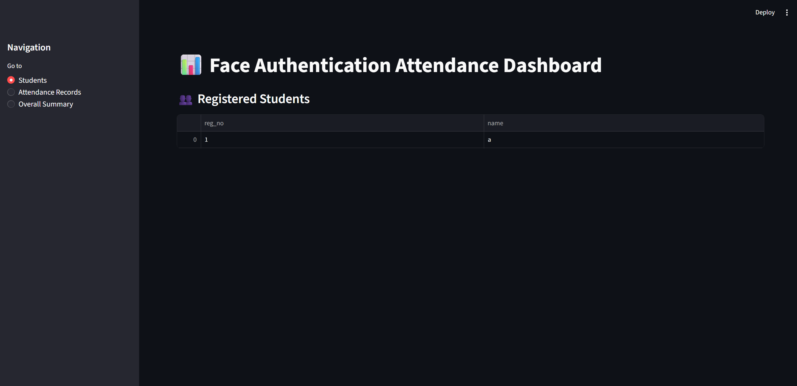
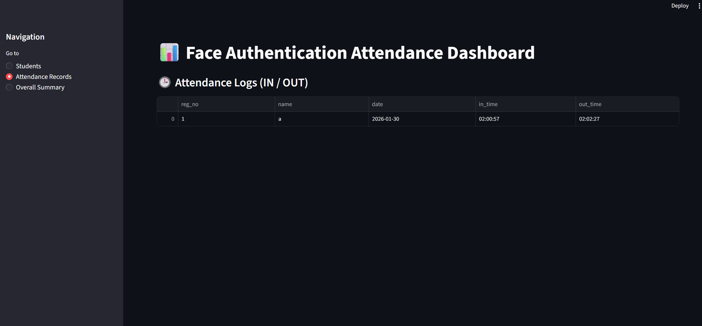
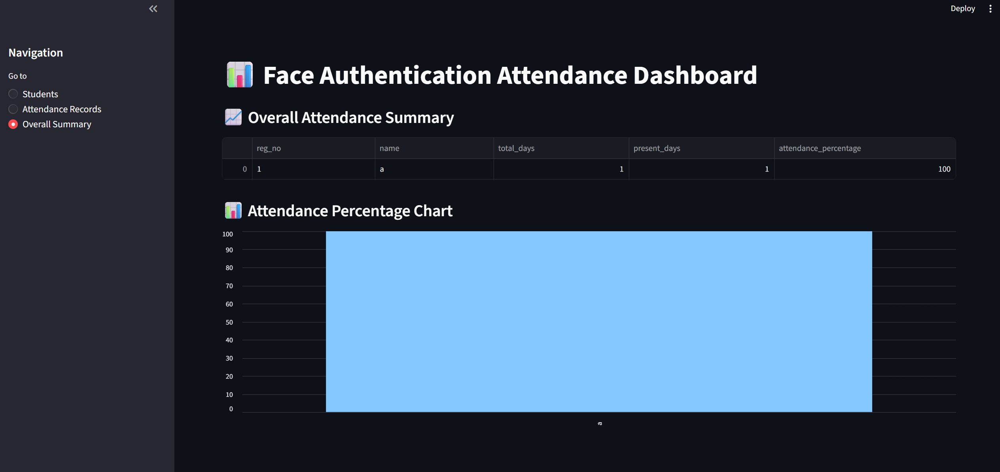

# 🎯 Face Authentication Attendance System

A **complete end-to-end face recognition–based attendance system** that performs **real-time face authentication with liveness detection**, marks **IN/OUT attendance**, and provides a **Streamlit-powered admin dashboard** for visualization and analysis.

This project is designed as a **production-style ML system**, not just a demo — covering enrollment, authentication, database persistence, failure handling, and analytics.

---

## 🧰 Tech Stack

<p align="center">
  
  
  
  
  
  
</p>

---

## 🚀 Key Features

- 🎥 **Camera-based Enrollment** (no image uploads)
- 🧠 **DeepFace (FaceNet) Embeddings** for identity representation
- 🛡️ **Motion-based Liveness Detection** (anti-spoof)
- ⏱️ **Session-based Authentication** (one-shot, no looping)
- 🟢 **Automatic IN / OUT Attendance Marking**
- 🗄️ **SQLite Database (persistent & lightweight)**
- 📊 **Streamlit Admin Dashboard**
- 🔒 **Privacy-safe** (no face images stored)

---

## 🧠 System Architecture

```
Camera
  ↓
Face Detection (OpenCV)
  ↓
Embedding Extraction (DeepFace – FaceNet)
  ↓
Motion Liveness Check
  ↓
Embedding Matching (Euclidean Distance)
  ↓
Authentication Decision
  ↓
Attendance DB (SQLite)
  ↓
Streamlit Dashboard
```

---

## 📂 Project Structure

```
faceAuthAttain/
├── authenticate_camera.py   # One-shot authentication + attendance
├── enroll_camera.py         # Camera-based enrollment
├── dashboard.py             # Streamlit admin interface
├── db.py                    # Database utilities
├── data/
│   ├── attendance.db        # SQLite database
│   └── embeddings/          # Stored face embeddings (.npy)
├── requirements.txt
└── README.md
```

---

## 📝 Enrollment Flow

1. User enters **Registration Number & Name**
2. Camera opens automatically
3. Multiple valid face frames are captured
4. Mean embedding is computed
5. Data saved:
   - `students` table (reg_no, name)
   - `embeddings/<reg_no>.npy`

✔ No images are stored

---

## 🔐 Authentication & Attendance Flow

- Camera opens
- Motion-based liveness is verified
- Face embedding is extracted
- Compared against stored embeddings
- If matched:
  - First authentication → **IN time marked**
  - Second authentication → **OUT time marked**
- Camera closes immediately after success

❌ If liveness fails or face mismatch → access denied

---

## 📊 Streamlit Dashboard

The dashboard provides a **read-only admin interface** to visualize attendance data.

### 🧑‍🎓 Students Page
Displays all enrolled students.



---

### ⏱️ Attendance Records
Shows daily IN / OUT logs.



---

### 📈 Overall Attendance Summary
- Total days
- Present days
- Attendance percentage
- Visual bar chart



---

## 🗄️ Database Schema

### `students`
| Column | Type | Description |
|------|------|------------|
| reg_no | TEXT (PK) | Registration Number |
| name | TEXT | Student Name |

### `attendance`
| Column | Type | Description |
|------|------|------------|
| id | INTEGER | Primary Key |
| reg_no | TEXT | Registration Number |
| name | TEXT | Student Name |
| date | TEXT | Date |
| in_time | TEXT | IN time |
| out_time | TEXT | OUT time |

---

## ⚠️ Failure Cases & Handling

| Scenario | Handling |
|-------|----------|
| No face detected | Frame skipped |
| Mask / sunglasses | Authentication denied |
| No motion | Liveness fails |
| Spoof (photo/video) | Blocked by motion check |
| Unknown face | Access denied |
| Multiple faces | Best match only |
| Duplicate attendance | Prevented by session logic |

---

## 🛡️ Security & Privacy

- ❌ No raw images stored
- ✅ Only numerical embeddings
- ✅ Local SQLite DB
- ✅ Read-only dashboard

---

## ⚙️ Installation & Run

```bash
pip install -r requirements.txt
```

### Enrollment
```bash
python enroll_camera.py
```

### Authentication
```bash
python authenticate_camera.py
```

### Dashboard
```bash
streamlit run dashboard.py
```

---

## 🏆 Why This Project Stands Out

- Not just face recognition — **full ML system**
- Real-world concerns handled (spoofing, DB consistency)
- Clean session-based authentication
- End-to-end pipeline from camera → analytics

---

## 📌 Future Improvements

- Blink / head-pose liveness
- Admin login for dashboard
- Cloud DB support
- Multi-camera support
- Export attendance reports

---

## 👤 Author

**Aryus Kumar**  
AI/ML | Computer Vision | Systems Design

---

⭐ If you found this project useful, consider starring the repository!

